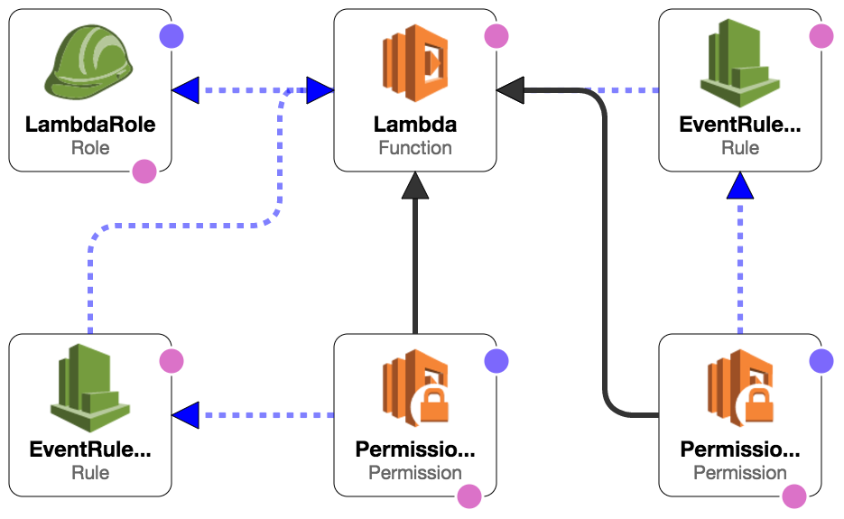

==============================
Dr. DNS -- Dynamic DNS for AWS
==============================

Dr. DNS is a serverless app providing dynamic DNS on AWS. EC2 instances tagged
with a ``Name`` that matches one of your domains in Route 53 will automatically
have entries created (and removed) for them on startup (and shutdown/stop).

-----------------------------
Tags Used & How They Are Used
-----------------------------

``Name = something.example.com``
    Records created are ``<instance-id>.something.example.com`` and
    ``something.example.com``. If multiple hosts have the same name, they will
    each have a unique record ``<instance-id>.something.example.com`` and
    ``something.example.com`` will round-robin between them. As a special case,
    if ``Name`` already includes the instance ID, like
    ``<instance-id>.a.b.c``, then it is treated as though it were just the
    base name: a record is created for ``<instance-id>.a.b.c`` pointing only at
    the instance, and a round-robin record is created at ``a.b.c``. The
    ``Name`` tag thus behaves ergonomically when used with either individual
    instances or auto-scaling groups.

``dns:fqdn = name.example.com``, ``dns:fqdn:... = name.example.com``
    One or many DNS names can be assigned to an instance with the tag
    ``dns:fqdn`` and tags prefixed with ``dns:fqdn:`` (like: ``dns:fqdn:1``,
    ``dns:fqdn:2``). These names are used exactly as given.

``dns:base = group.example.com``, ``dns:base:... = group.example.com``
    When the tag ``dns:base`` or a tag prefixed with ``dns:base:`` (like:
    ``dns:base:1``, ``dns:base:2``) is specified, two records are created:
    a round-robin record like ``group.example.com`` which points to all
    instances sharing the same base, and a record
    ``<instance-id>.group.example.com`` pointing to just that specific
    instance. This is especially useful with auto-scaling groups.

When tags are assigned to an auto-scaling group, they can be automatically
inherited by the instances in the group. This works well with the ``Name`` and
``dns:base`` and ``dns:base:...`` style tags. To enable tagging of instances,
check the **Tag New Instances** option in the Amazon console or set
``PropagateAtLaunch`` from the AWS APIs when creating the group.

The tags are always weighted records, identified by the instance ID, even when
they point directly to the instance, to ensure that Dr. DNS updates and deletes
only a very narrow selection of records.

-----------------------------------
Setup with Cloud Formation Template
-----------------------------------

Setting up the permissions and event streams for a serverless application is
almost as much work as writing the application itself. The Cloud Formation
template sets up the Lambda and provides it with appropriate permissions and
event streams for instances launched in EC2 directly or by way of an
auto-scaling group:

`View in the CloudFormation template designer.`_

.. _View in the CloudFormation template designer.: https://us-west-2.console.aws.amazon.com/cloudformation/designer/home?templateUrl=https://s3-us-west-2.amazonaws.com/s3.drcloud.io/drdns/drdns.template.json

--------------------------
Frequently Asked Questions
--------------------------

What kinds of records does Dr. DNS create?
    Dr. DNS creates members of "weighted record sets", identified by the
    instance ID, even when they point directly to the instance, to ensure that
    only a narrow band of records are ever updated or deleted.

What is the target of the records created by Dr. DNS?
    The EC2 instance's public DNS name is used in preference to the private DNS
    name, where available.

How does Dr. DNS handle invalid DNS names in tags?
    If a tag does not match the domain name syntax restrictions, Dr. DNS logs
    as much and returns early.

How does Dr. DNS know which domain in which to place a record?
    The domain or domains with the longest suffix match on a record name are
    used to store the record.
